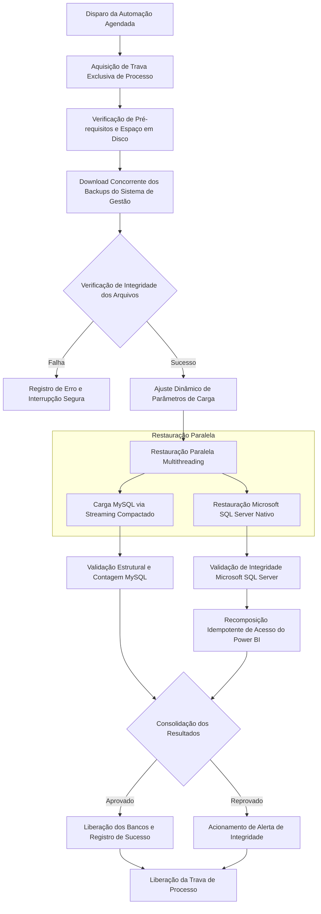

# Agente KSI — Automação de Cargas, Restauração e Disponibilização para BI

> **Repositório vitrine.** Apenas apresentação do projeto. O código-fonte é privado. Autor: Caio Alba de Camargo.

## 1. Visão geral e problema que resolve

O Agente KSI é uma solução de engenharia de dados desenvolvida para automatizar de forma integral o fluxo diário de extração, restauração, validação e disponibilização de dados operacionais para a camada de Business Intelligence corporativa. 

Nas operações diárias, o sistema de gestão central (ERP) gera backups consolidados durante a madrugada. Anteriormente, a disponibilização dessas informações para relatórios executivos exigia processos manuais lentos e propensos a falhas: download manual de arquivos com dezenas de gigabytes, descompactação intermediária em disco, restauração manual em instâncias distintas de bancos de dados (MySQL e Microsoft SQL Server) e reconfiguração de privilégios de acesso.

O agente resolve esse gargalo operando de maneira autônoma, concorrente e segura. Ele sincroniza os artefatos gerados pelo sistema de gestão, realiza a descompactação e importação em fluxo contínuo (streaming), executa checagens rigorosas de integridade e reconstrói de forma idempotente as credenciais técnicas do Power BI, garantindo que os painéis gerenciais estejam prontos e consistentes antes do início do expediente.

## 2. Como funciona (fluxo ponta a ponta)

O pipeline executa em ciclos planejados e encadeados, garantindo isolamento de processos e consistência transacional:

1. **Bloqueio de Execução:** Uma trava exclusiva no sistema de arquivos impede que instâncias simultâneas do pipeline entrem em concorrência.
2. **Pré-inspeção:** O ambiente valida conectividade, parâmetros do motor de banco de dados e disponibilidade de armazenamento.
3. **Aquisição:** O módulo autentica no portal do sistema de gestão e transfere os artefatos diários (arquivos relacionais compactados e backups nativos).
4. **Carga em Streaming:** A restauração do banco relacional ocorre lendo diretamente o fluxo compactado em memória, suprimindo temporariamente restrições de chaves para viabilizar a ingestão em lote em minutos.
5. **Restauração Heterogênea:** O backup do banco colunar/estruturado é restaurado simultaneamente em thread dedicada.
6. **Reatribuição de Segurança:** O agente recria e vincula o usuário técnico do Power BI na base restaurada com privilégios estritos de leitura.
7. **Validação e Encerramento:** Contagem comparativa de tabelas e registros atesta o sucesso antes de consolidar os registros operacionais.

## 3. Funcionalidades detalhadas

- **Aquisição Automatizada de Artefatos:** Localização e transferência programada dos pacotes de dados mais recentes gerados pelo ERP na nuvem.
- **Prevenção de Execuções Concorrentes:** Mecanismo de trava não bloqueante baseado em primitivas do sistema operacional para impedir sobreposição de cargas.
- **Restauração Heterogênea Paralela:** Processamento simultâneo com gerenciamento de trabalhadores em paralelo para MySQL e Microsoft SQL Server Express, reduzindo pela metade a janela de manutenção.
- **Ingestão em Fluxo Contínuo (Streaming):** Importação direta do fluxo compactado para a base relacional, eliminando a necessidade de espaço temporário para arquivos descompactados intermediários.
- **Otimização Dinâmica de Cargas Massivas:** Configuração automatizada de modos de importação rápida, desativando transações únicas pesadas e restrições estruturais durante a carga, reativando-as ao término.
- **Reatribuição Idempotente de Acesso Analítico:** Reassociação automática de logins e permissões do usuário de relatórios após a restauração da base, prevenindo perda de vínculo entre logins do servidor e usuários de bancos recém-restaurados.
- **Validação de Sanidade Pós-Restauração:** Verificação de contagem de entidades e tabelas essenciais para garantir que a restauração não produziu bases incompletas ou corrompidas.
- **Sistema de Logs Estruturados por Estágio:** Segregação de rastreabilidade com registros individualizados para download, restauração, validação e execução de scripts de suporte.
- **Kit de Migração e Topologia em Dois Computadores:** Scripts de homologação e diagnóstico para separar a carga de banco de dados do servidor de controle de infraestrutura de rede, garantindo continuidade de negócios.

## 4. Fontes de dados / conteúdo e como são tratados

- **Backup Relacional Principal (MySQL):** Arquivo de despejo lógico com estrutura e dados do ERP compactado em formato gzip. É tratado como fluxo de entrada canalizado diretamente para o binário cliente do banco de dados, reconstruindo o catálogo com limpeza prévia e sem explosão de consumo de disco.
- **Backup Nativo Estruturado (Microsoft SQL Server):** Arquivo de backup binário proprietário (.bak) com índices e dados analíticos. É tratado através de comandos utilitários de restauração com substituição forçada controlada e verificação de integridade dos arquivos físicos.
- **Mapeamento de Tabelas Analíticas:** Após a carga, os esquemas são validados quanto ao número esperado de tabelas para assegurar que nenhum módulo do ERP falhou na extração de origem.

## 5. Permissões e controle de acesso

- **Segregação de Funções:** Os processos de ingestão executam sob credenciais administrativas locais estritamente necessárias para recriar bases de dados e gerenciar variáveis globais de sistema.
- **Privilégio Mínimo para Camada de Negócio:** As contas de serviço consumidas pelas estações do Power BI possuem acesso exclusivamente consultivo (leitura de dados e visualização de esquemas), sendo explicitamente bloqueadas contra qualquer instrução de escrita, modificação ou exclusão.
- **Restrição por Endereço de Rede:** As contas técnicas de banco de dados para consumo analítico são configuradas para aceitar conexões apenas a partir de endereços de rede fixos e identificados pertencentes aos analistas homologados.
- **Isolamento de Contas Administrativas:** O usuário administrador dos motores de banco de dados não é compartilhado com relatórios, aplicações externas ou ferramentas de BI.

## 6. Agendamento/automação e tratamento de falhas

- **Agendamento Noturno:** Orquestrado para disparo diário na madrugada via agendador de tarefas do sistema operacional corporativo, assegurando que o processamento ocorra durante o período de menor tráfego de rede e sem usuários operando o sistema.
- **Políticas de Retentativa Resilientes:** Rotinas de download e restauração possuem contadores de tentativas com intervalos de espera progressivos para tolerar oscilações momentâneas de conectividade com o portal.
- **Controle de Tempo Limite (Timeouts):** Operações de rede e de banco de dados possuem prazos máximos definidos para evitar que conexões travadas retenham recursos do servidor indefinidamente.
- **Falha Fechada e Código de Retorno:** Caso ocorra erro em qualquer etapa da cadeia (falha de download, integridade corrompida ou inconsistência de tabelas), a execução é abortada, os detalhes técnicos são gravados em log de auditoria e um código de falha é retornado para alertar o monitoramento.

## 7. Segurança e privacidade

- **Gestão Segura de Configurações:** Arquivos contendo senhas, credenciais de acesso ao portal do ERP e segredos de conexão residem exclusivamente no servidor de execução, protegidos contra leitura não autorizada e completamente excluídos do versionamento de código.
- **Proteção de Argumentos em Memória:** As credenciais de bancos de dados durante as etapas de preparação são passadas via variáveis temporárias protegidas de ambiente do processo, evitando a exposição de senhas em linhas de comando legíveis pelo gerenciador de tarefas.
- **Privacidade e Governança:** O agente não armazena nem envia dados de clientes, transações financeiras ou informações de negócios para servidores externos ou serviços de inteligência artificial de terceiros; todo o processamento de descompactação e restauração ocorre estritamente dentro da infraestrutura interna da empresa.
- **Trilhas de Auditoria Sanitizadas:** Os arquivos de log registram marcos de início, término, tamanho de arquivos transferidos, tempos de processamento e códigos de erro sem jamais imprimir credenciais, dados de clientes ou conteúdos de tabelas.

## 8. Tecnologias

- **Linguagem Principal:** Python (com módulos nativos de concorrência multithreading, gerenciamento de arquivos de baixo nível, temporização de precisão e utilitários de sistema).
- **Motores de Banco de Dados:** MySQL Server e Microsoft SQL Server Express.
- **Ferramentas de Carga e Linha de Comando:** Utilitários nativos de cliente de banco de dados, utilitários de comando SQL e scripts de automação em lote.
- **Camada de Consumo Analítico:** Microsoft Power BI Desktop e conectores de dados locais.
- **Automação e Sistema Operacional:** Windows Server / Windows Enterprise, Agendador de Tarefas do Windows e PowerShell.

## 9. Resultados e benefícios

- **Autonomia Completa:** Eliminação total da necessidade de intervenção humana diária para extrair e restaurar bases de dados pesadas.
- **Janela de Processamento Reduzida:** O paralelismo entre MySQL e SQL Server aliado ao streaming descompactado reduziu o tempo total do pipeline para cerca de 30 minutos na madrugada.
- **Disponibilidade Imediata para Decisores:** Relatórios gerenciais e dashboards estratégicos ficam 100% atualizados antes do início das atividades das equipes de negócios.
- **Eliminação de Indisponibilidade no BI:** A recomposição programática de permissões pós-restauração extinguiu os incidentes em que o Power BI perdia conexão com o banco restaurado.
- **Economia Significativa de Disco:** A ausência de dumps intermediários descompactados economizou dezenas de gigabytes diários em armazenamento de estado sólido.

## 10. Limitações e próximos passos

- **Dependência do Horário da Origem:** A execução depende de o sistema de gestão em nuvem disponibilizar pontualmente os backups antes da janela matinal.
- **Notificação e Alertas Móveis:** Integração planejada com serviços de mensageria corporativa e e-mail institucional para envio instantâneo de resumos de execução e chamados automáticos em caso de falha.
- **Gatilho Automático no Power BI Service:** Implementação de chamada segura à API oficial do Power BI para disparar o refresh do conjunto de dados em nuvem imediatamente após a confirmação das tabelas.
- **Monitoramento de Deriva Estrutural (Schema Drift):** Criação de validador contratual que compara previamente a estrutura das tabelas restauradas com o modelo de dados homologado, alertando a equipe técnica sobre alterações de colunas pelo fornecedor do ERP.

---

Autor: [Caio Alba de Camargo](https://github.com/caioalba)
